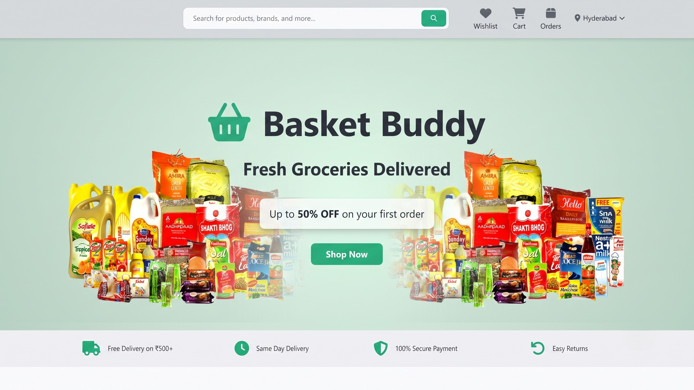

# Portfolio Website - Setup & Update Guide

## 📋 Table of Contents
1. [Initial Setup](#initial-setup)
2. [Making Changes](#making-changes)
3. [Testing Locally](#testing-locally)
4. [Pushing to GitHub](#pushing-to-github)
5. [Project Structure](#project-structure)
6. [Common Tasks](#common-tasks)

---

## 🚀 Initial Setup

### Prerequisites
- Git installed on your computer
- Node.js installed (for local server)
- A code editor (VS Code recommended)
- GitHub account

### Clone Your Repository
```bash
cd Desktop
git clone https://github.com/denny-sathwik/portfolio-website.git
cd portfolio-website
```

---

## ✏️ Making Changes

### 1. Update Project Information

#### Edit Project Details in `index.html`
Find the project card you want to update (lines 211-412):

```html
<article class="project__card" data-category="web">
    <div class="project__image">
        
        ...
    </div>
    <div class="project__content">
        <h3 class="project__title">E-Commerce Platform</h3>
        <p class="project__description">
            A full-stack e-commerce solution with payment integration and admin dashboard.
        </p>
        <div class="project__tags">
            <span class="project__tag">React</span>
            <span class="project__tag">Node.js</span>
            <span class="project__tag">MongoDB</span>
        </div>
    </div>
</article>
```

**What to change:**
- `src="images/projects/project1.jpg"` - Update image path
- `<h3 class="project__title">` - Change project name
- `<p class="project__description">` - Update description
- `<span class="project__tag">` - Modify technology tags
- `href="https://..."` - Update demo and GitHub links

### 2. Add Project Images

**Steps:**
1. Prepare your project images (recommended size: 800x600px)
2. Name them: `project1.jpg`, `project2.jpg`, etc.
3. Place them in: `portfolio-website/images/projects/`

**Image Requirements:**
- Format: JPG, PNG, or WebP
- Size: Keep under 500KB for fast loading
- Dimensions: 800x600px (4:3 ratio) recommended

### 3. Update Personal Information

#### Contact Details (`index.html` lines 437-461)
```html
<a href="mailto:dennysathwik@gmail.com">dennysathwik@gmail.com</a>
<a href="tel:+91 8341672083">+91 8341672083</a>
<span class="contact__detail-value">Hyderabad, India</span>
```

#### Social Links (lines 466-477, 537-541, 550-561)
```html
<a href="https://github.com/denny-sathwik">GitHub</a>
<a href="https://www.linkedin.com/in/sai-sathwik-249511250/">LinkedIn</a>
```

### 4. Modify Styles

Edit `css/style.css` to change:
- Colors (search for color variables at the top)
- Fonts
- Spacing
- Animations

**Example - Change Primary Color:**
```css
:root {
    --primary-color: #6366f1;  /* Change this hex code */
}
```

---

## 🧪 Testing Locally

### Method 1: Using Node.js http-server (Recommended)

1. **Start the server:**
```bash
cd portfolio-website
npx http-server -p 8000
```

2. **Open in browser:**
- Visit: `http://localhost:8000/`
- Or: `http://127.0.0.1:8000/`

3. **Stop the server:**
- Press `Ctrl + C` in the terminal

### Method 2: Using Python

```bash
cd portfolio-website
python -m http.server 8000
```

### Method 3: Using VS Code Live Server Extension

1. Install "Live Server" extension in VS Code
2. Right-click `index.html`
3. Select "Open with Live Server"

---

## 📤 Pushing to GitHub

### Step-by-Step Process

1. **Check what changed:**
```bash
cd portfolio-website
git status
```

2. **Add all changes:**
```bash
git add .
```

3. **Commit with a message:**
```bash
git commit -m "Update project details and add new images"
```

4. **Push to GitHub:**
```bash
git push origin main
```

### Common Commit Messages
- `"Add new project: [Project Name]"`
- `"Update contact information"`
- `"Fix styling issues in projects section"`
- `"Add project images"`
- `"Update skills section"`

---

## 📁 Project Structure

```
portfolio-website/
├── index.html              # Main HTML file
├── css/
│   └── style.css          # All styles
├── js/
│   └── script.js          # JavaScript functionality
├── images/
│   └── projects/
│       ├── profile.jpg    # Your profile photo
│       ├── project1.jpg   # Project screenshots
│       ├── project2.jpg
│       └── ...
├── README.md              # Project documentation
└── SETUP-GUIDE.md         # This file
```

---

## 🔧 Common Tasks

### Add a New Project

1. **Copy an existing project card** in `index.html`
2. **Update the details:**
   - Image path
   - Title
   - Description
   - Tags
   - Links
3. **Add the project image** to `images/projects/`
4. **Test locally**
5. **Push to GitHub**

### Change Profile Photo

1. Replace `images/projects/profile.jpg` with your photo
2. Keep the same filename or update references in HTML
3. Recommended size: 400x400px

### Update Skills

Find the skills section (lines 160-202) and modify:

```html
<div class="skills__category">
    <h3 class="skills__category-title">Frontend & Backend Development</h3>
    <div class="skills__tags">
        <span class="skill__tag">HTML/CSS</span>
        <span class="skill__tag">JavaScript</span>
        <!-- Add more skills -->
    </div>
</div>
```

### Change Color Theme

Edit `css/style.css` root variables:

```css
:root {
    --primary-color: #6366f1;      /* Main theme color */
    --secondary-color: #8b5cf6;    /* Accent color */
    --text-color: #1f2937;         /* Text color */
    --bg-color: #ffffff;           /* Background */
}
```

### Fix Browser Cache Issues

If changes don't appear:
1. **Hard refresh:** `Ctrl + Shift + R` (Windows) or `Cmd + Shift + R` (Mac)
2. **Clear cache:** `Ctrl + Shift + Delete`
3. **Use incognito mode:** `Ctrl + Shift + N`

---

## 🐛 Troubleshooting

### Images Not Showing
- Check file path is correct
- Verify image exists in `images/projects/`
- Check file extension matches (jpg vs jpeg vs png)
- Clear browser cache

### Changes Not Appearing
- Hard refresh the browser
- Check if you saved the file
- Restart the local server
- Clear browser cache

### Git Push Fails
```bash
# Pull latest changes first
git pull origin main

# Then push again
git push origin main
```

### Server Won't Start
- Check if port 8000 is already in use
- Try a different port: `npx http-server -p 3000`
- Close other running servers

---

## 📝 Best Practices

1. **Always test locally** before pushing to GitHub
2. **Commit frequently** with clear messages
3. **Keep images optimized** (compress before uploading)
4. **Backup your work** regularly
5. **Use meaningful file names**
6. **Comment your code** for future reference

---

## 🔗 Useful Links

- **GitHub Repository:** https://github.com/denny-sathwik/portfolio-website
- **Live Website:** https://denny-sathwik.github.io/portfolio-website
- **Git Documentation:** https://git-scm.com/doc
- **HTML Reference:** https://developer.mozilla.org/en-US/docs/Web/HTML
- **CSS Reference:** https://developer.mozilla.org/en-US/docs/Web/CSS

---

## 💡 Quick Reference Commands

```bash
# Navigate to project
cd portfolio-website

# Check status
git status

# Add all changes
git add .

# Commit changes
git commit -m "Your message here"

# Push to GitHub
git push origin main

# Pull latest changes
git pull origin main

# Start local server
npx http-server -p 8000

# View git history
git log --oneline
```

---

## 📞 Need Help?

If you encounter issues:
1. Check this guide first
2. Search for the error message online
3. Check GitHub Issues
4. Ask in developer communities (Stack Overflow, Reddit)

---

**Last Updated:** June 24, 2026
**Version:** 1.0