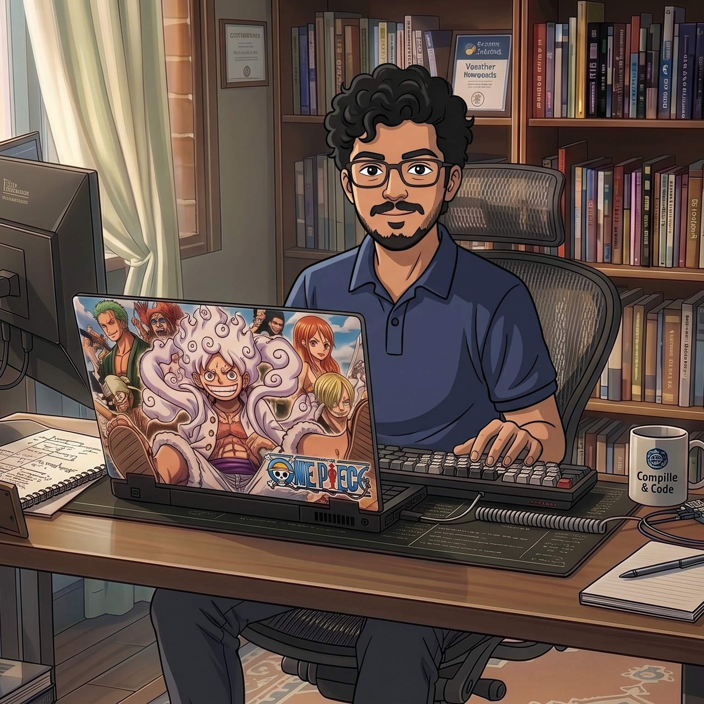
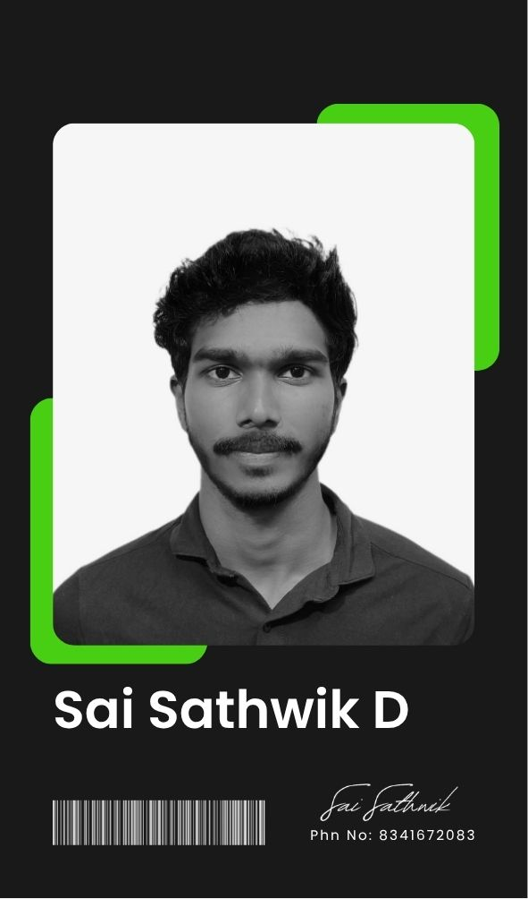

# Portfolio Website - Setup & Update Guide

## Table of Contents
1. [Initial Setup](#initial-setup)
2. [Making Changes](#making-changes)
3. [Update Project Photos](#update-project-photos)
4. [Add / Update Resume Download](#add--update-resume-download)
5. [Add / Update Project Links (Live Demo & GitHub)](#add--update-project-links-live-demo--github)
6. [Add a New Project Card](#add-a-new-project-card)
7. [Testing Locally](#testing-locally)
8. [Pushing to GitHub](#pushing-to-github)
9. [Project Structure](#project-structure)
10. [Common Tasks](#common-tasks)

---

## Initial Setup

### Prerequisites
- Git installed on your computer
- Node.js installed (for local server)
- A code editor (VS Code recommended)
- GitHub account

### Clone Your Repository
```
cd Desktop
git clone https://github.com/denny-sathwik/portfolio-website.git
cd portfolio-website
```

---

## Making Changes

### 1. Update Project Information

Find the project card you want to update in index.html (lines 211-412):

```
<article class="project__card" data-category="web">
    <div class="project__image">
        
    </div>
    <div class="project__content">
        <h3 class="project__title">E-Commerce Platform</h3>
        <p class="project__description">Description here.</p>
        <div class="project__tags">
            <span class="project__tag">React</span>
        </div>
    </div>
</article>
```

**What to change:**
- src="images/projects/project1.jpg" - Update image path
- project__title - Change project name
- project__description - Update description
- project__tag - Modify technology tags
- href="https://..." - Update demo and GitHub links

### 2. Add Project Images

1. Prepare images (recommended: 800x600px, under 500KB)
2. Name them: project1.jpg, project2.jpg, etc.
3. Place them in: portfolio-website/images/projects/

### 3. Update Personal Information

Contact Details (index.html lines 437-461):
```
<a href="mailto:dennysathwik@gmail.com">dennysathwik@gmail.com</a>
<a href="tel:+91 8341672083">+91 8341672083</a>
<span class="contact__detail-value">Hyderabad, India</span>
```

Social Links (lines 466-477, 537-541, 550-561):
```
<a href="https://github.com/denny-sathwik">GitHub</a>
<a href="https://www.linkedin.com/in/sai-sathwik-249511250/">LinkedIn</a>
```

### 4. Modify Styles

Edit css/style.css — change the primary color:
```
:root {
    --primary-color: #6366f1;
}
```

---

## Update Project Photos

Each project card displays a screenshot image in the top half of the card.
All project images live in the `images/projects/` folder.

### Image requirements

| Property    | Recommendation                         |
|-------------|----------------------------------------|
| Format      | `.jpg` or `.png`                        |
| Dimensions  | 800 × 600 px (4:3) or 1280 × 720 px (16:9) |
| File size   | Under 500 KB per image                 |
| Color space | sRGB                                   |

> **Tip — take a screenshot of the running project:** open the app in a browser, press F12 → toggle device toolbar, set a fixed width (e.g. 1280 px), then use the browser's screenshot tool or a tool like ShareX / Snagit to capture it.

---

### Current image map

| Card | Project title                              | Image file                          | Line in index.html |
|------|--------------------------------------------|-------------------------------------|--------------------|
| 1    | Basket Buddy                               | `images/projects/project1.jpg`      | 222                |
| 2    | AI Investment Strategy Advisory            | `images/projects/project2.jpg`      | 255                |
| 3    | Pneumonia Detection System                 | `images/projects/project3.jpg`      | 289                |
| 4    | Blockchain-Based Certificate Verification  | `images/projects/project4.jpg`      | 324                |
| 5    | Weather Dashboard                          | `images/projects/project5.jpg`      | 358                |
| 6    | My Portfolio                               | `images/projects/project6.jpg`      | 392                |

Profile photos used in other sections:

| Section     | Image file                               | Line in index.html |
|-------------|------------------------------------------|--------------------|
| Hero (home) | `images/projects/home-profile.jpg`       | 110                |
| About Me    | `images/projects/about-profile.jpg`      | 123                |

---

### Step 1 — Prepare your screenshot

1. Take a screenshot of the finished project (browser, mockup tool, or design file).
2. Resize to **800 × 600 px** (use Paint, GIMP, Squoosh, or any image editor).
3. Export / save as `.jpg` with quality **80–90%** to keep the file small.
4. Rename the file to match the filename in the table above (e.g. `project1.jpg`).

> To compress an image online without installing software, use **https://squoosh.app** — drag in the file, pick MozJPEG, set quality to 80, download.

---

### Step 2 — Place the file in the right folder

```
portfolio-website/
    images/
        projects/
            project1.jpg   <- Basket Buddy screenshot
            project2.jpg   <- AI Investment screenshot
            project3.jpg   <- Pneumonia Detection screenshot
            project4.jpg   <- Blockchain Certificate screenshot
            project5.jpg   <- Weather Dashboard screenshot
            project6.jpg   <- My Portfolio screenshot
            home-profile.jpg   <- Hero section photo (already exists)
            about-profile.jpg  <- About section photo (already exists)
```

Use exactly these filenames — they are already referenced in `index.html`.

---

### Step 3 — (Optional) Use a different filename or format

If you prefer a different filename (e.g. `basket-buddy.png`), update the `src` attribute on the matching line in `index.html`:

```html
<!-- Before (line 222) -->


<!-- After -->

```

Also update the `alt` text to describe the project — this helps accessibility and SEO.

---

### Step 4 — Update all six cards at once (quick reference)

Open `index.html` and change only the `src` values on these lines:

| Line | Change `src` to                          |
|------|------------------------------------------|
| 222  | `images/projects/project1.jpg`           |
| 255  | `images/projects/project2.jpg`           |
| 289  | `images/projects/project3.jpg`           |
| 324  | `images/projects/project4.jpg`           |
| 358  | `images/projects/project5.jpg`           |
| 392  | `images/projects/project6.jpg`           |

---

### Step 5 — Update profile photos

**Hero section** (line 110):
```html

```
Replace `home-profile.jpg` in `images/projects/` with your photo.
Recommended size: **400 × 400 px**, square crop.

**About section** (line 123):
```html

```
Replace `about-profile.jpg` in `images/projects/` with your photo.
Recommended size: **400 × 500 px**, portrait crop.

---

### Step 6 — Test locally

Start the local server and open http://localhost:8000:

```
npx http-server -p 8000
```

Check that each card shows the correct screenshot.
If an image does not appear:
- Confirm the filename and extension match exactly (case-sensitive on GitHub Pages: `Project1.jpg` ≠ `project1.jpg`).
- Check the browser console (F12 → Console) for a 404 error — it will show the exact path the browser tried to load.
- Hard-refresh with **Ctrl + Shift + R** to bypass cache.

---

### Step 7 — Commit and push

```
git add images/projects/
git commit -m "Add project screenshots"
git push origin main
```

If you also edited `index.html` to change filenames or alt text:

```
git add images/projects/ index.html
git commit -m "Add project screenshots and update image references"
git push origin main
```

---

## Add / Update Resume Download

The "Download Resume" button is at line 154 of index.html.

### Current HTML
```
<a href="#" class="btn btn-primary" download>Download Resume</a>
```

### Step 1 — Add your PDF file

Export your resume as a PDF, e.g. Denny_Sathwik_Resume.pdf, and place it in the project root:

```
portfolio-website/
    index.html
    Denny_Sathwik_Resume.pdf   <- place it here
    css/
    js/
    images/
```

You can also use a subfolder: files/Denny_Sathwik_Resume.pdf

### Step 2 — Update line 154 in index.html

```
<!-- Before -->
<a href="#" class="btn btn-primary" download>Download Resume</a>

<!-- After (file in root) -->
<a href="Denny_Sathwik_Resume.pdf" class="btn btn-primary" download>Download Resume</a>

<!-- After (file in subfolder) -->
<a href="files/Denny_Sathwik_Resume.pdf" class="btn btn-primary" download>Download Resume</a>
```

The download attribute tells the browser to save the file instead of opening it.

### Step 3 — (Optional) Set the suggested save filename

```
<a href="files/Denny_Sathwik_Resume.pdf" class="btn btn-primary" download="Denny_Sathwik_Resume">Download Resume</a>
```

### Step 4 — Commit and push the PDF

```
git add Denny_Sathwik_Resume.pdf index.html
git commit -m "Add downloadable resume PDF"
git push origin main
```

NOTE: If the PDF is larger than 5 MB, host it on Google Drive or OneDrive and link to the direct share URL instead of committing it to the repo.

---

## Add / Update Project Links (Live Demo & GitHub)

Each project card has two icon-links inside class="project__links" that appear on hover:
- External link icon  ->  Live demo / deployed site
- GitHub icon         ->  GitHub repository

### Pattern used in every card

```
<div class="project__links">

    <!-- Live demo -->
    <a href="https://denny-sathwik.github.io/YOUR-PROJECT"
       class="project__link" target="_blank" aria-label="View live demo">
        <svg>...</svg>
    </a>

    <!-- GitHub repo -->
    <a href="https://github.com/denny-sathwik/YOUR-REPO"
       class="project__link" target="_blank" aria-label="View GitHub repository">
        <svg>...</svg>
    </a>

</div>
```

### Line reference for each card

| Project Card           | Live demo href | GitHub href |
|------------------------|---------------|-------------|
| Card 1 (Basket Buddy)  | line 217      | line 224    |
| Card 2 (AI Investment) | line 250      | line 257    |
| Card 3                 | line 284      | line 291    |
| Card 4                 | line 318      | line 325    |
| Card 5                 | line 352      | line 359    |
| Card 6                 | line 386      | line 393    |

### Example — updating Card 1

Live demo (line 217):
```
<!-- Before -->
<a href="https://denny-sathwik.github.io/ecommerce-platform" class="project__link" ...>

<!-- After -->
<a href="https://denny-sathwik.github.io/basket-buddy" class="project__link" ...>
```

GitHub (line 224):
```
<!-- Before -->
<a href="https://github.com/denny-sathwik/ecommerce-platform" class="project__link" ...>

<!-- After -->
<a href="https://github.com/denny-sathwik/basket-buddy" class="project__link" ...>
```

### If a project has no live demo

Set href="#" and hide the icon with style="display:none":
```
<a href="#" class="project__link" style="display:none" aria-label="View live demo">
```

Or just delete the entire demo <a> tag — the GitHub icon will still appear.

### URL formats

Live demo (GitHub Pages):
  https://<username>.github.io/<repo-name>
  Example: https://denny-sathwik.github.io/basket-buddy

GitHub repo:
  https://github.com/<username>/<repo-name>
  Example: https://github.com/denny-sathwik/basket-buddy

To get the exact URL: open the repo on GitHub -> click the green Code button -> copy HTTPS URL -> remove the .git suffix.

---

## Add a New Project Card

1. Open index.html and find the last </article> in the projects section (around line 412).
2. Paste this template after it:

```
<!-- Project Card - NEW PROJECT -->
<article class="project__card" data-category="web">
    <div class="project__image">
        
        <div class="project__overlay">
            <div class="project__links">

                <!-- Live demo link -->
                <a href="https://denny-sathwik.github.io/YOUR-REPO"
                   class="project__link" target="_blank" aria-label="View live demo">
                    <svg xmlns="http://www.w3.org/2000/svg" width="20" height="20" viewBox="0 0 24 24"
                         fill="none" stroke="currentColor" stroke-width="2">
                        <path d="M18 13v6a2 2 0 0 1-2 2H5a2 2 0 0 1-2-2V8a2 2 0 0 1 2-2h6"></path>
                        <polyline points="15 3 21 3 21 9"></polyline>
                        <line x1="10" y1="14" x2="21" y2="3"></line>
                    </svg>
                </a>

                <!-- GitHub repo link -->
                <a href="https://github.com/denny-sathwik/YOUR-REPO"
                   class="project__link" target="_blank" aria-label="View GitHub repository">
                    <svg xmlns="http://www.w3.org/2000/svg" width="20" height="20" viewBox="0 0 24 24"
                         fill="none" stroke="currentColor" stroke-width="2">
                        <path d="M9 19c-5 1.5-5-2.5-7-3m14 6v-3.87a3.37 3.37 0 0 0-.94-2.61c3.14-.35
                                 6.44-1.54 6.44-7A5.44 5.44 0 0 0 20 4.77 5.07 5.07 0 0 0 19.91 1S18.73.65
                                 16 2.48a13.38 13.38 0 0 0-7 0C6.27.65 5.09 1 5.09 1A5.07 5.07 0 0 0 5
                                 4.77a5.44 5.44 0 0 0-1.5 3.78c0 5.42 3.3 6.61 6.44 7A3.37 3.37 0 0 0 9
                                 18.13V22"></path>
                    </svg>
                </a>

            </div>
        </div>
    </div>
    <div class="project__content">
        <h3 class="project__title">Your Project Title</h3>
        <p class="project__description">
            A short description of what the project does and the problem it solves.
        </p>
        <div class="project__tags">
            <span class="project__tag">Technology 1</span>
            <span class="project__tag">Technology 2</span>
            <span class="project__tag">Technology 3</span>
        </div>
    </div>
</article>
```

3. Replace YOUR-REPO, title, description, and tags with your real details.
4. Add the screenshot as images/projects/projectN.jpg.
5. Test locally then push to GitHub.

---

## Testing Locally

### Method 1: Node.js http-server (Recommended)
```
cd portfolio-website
npx http-server -p 8000
```
Open http://localhost:8000 — stop with Ctrl+C.

### Method 2: Python
```
cd portfolio-website
python -m http.server 8000
```

### Method 3: VS Code Live Server
1. Install the "Live Server" extension
2. Right-click index.html
3. Select "Open with Live Server"

---

## Pushing to GitHub

```
# 1. Check what changed
git status

# 2. Stage everything (including any new PDF or images)
git add .

# 3. Commit
git commit -m "Your message here"

# 4. Push
git push origin main
```

### Common Commit Messages
- "Add new project: [Project Name]"
- "Update contact information"
- "Add downloadable resume PDF"
- "Update live demo and GitHub links for all projects"
- "Fix styling issues in projects section"
- "Add project images"

---

## Project Structure

```
portfolio-website/
    index.html                   <- Main HTML file
    Denny_Sathwik_Resume.pdf     <- Resume (add this)
    css/
        style.css                <- All styles
    js/
        script.js                <- JavaScript functionality
    images/
        projects/
            profile.jpg          <- Your profile photo
            project1.jpg         <- Project screenshots
            project2.jpg
    README.md
    SETUP-GUIDE.md               <- This file
```

---

## Common Tasks

### Add a New Project
1. Copy an existing project card in index.html
2. Update: image path, title, description, tags, live demo link, GitHub link
3. Add the image to images/projects/
4. Test locally then push

### Change Profile Photo
1. Hero section: replace `images/projects/home-profile.jpg` (400×400 px recommended)
2. About section: replace `images/projects/about-profile.jpg` (400×500 px recommended)
3. Keep the same filenames — no HTML changes needed. Or rename the files and update `src` on lines 110 and 123 in `index.html`.

### Update Skills
Find lines 160-202 in index.html:
```
<span class="skill__tag">HTML/CSS</span>
<span class="skill__tag">JavaScript</span>
<!-- Add more here -->
```

### Change Color Theme
Edit css/style.css:
```
:root {
    --primary-color: #6366f1;
    --secondary-color: #8b5cf6;
    --text-color: #1f2937;
    --bg-color: #ffffff;
}
```

### Fix Browser Cache Issues
- Hard refresh: Ctrl+Shift+R
- Clear cache: Ctrl+Shift+Delete
- Incognito mode: Ctrl+Shift+N

---

## Troubleshooting

### Resume Not Downloading
- Check the PDF file exists at the path in href
- Filenames are case-sensitive on GitHub Pages — match exactly
- Test directly: http://localhost:8000/Denny_Sathwik_Resume.pdf
- Make sure you committed and pushed the PDF file

### Project Links Not Working
- Check GitHub Pages is enabled: repo -> Settings -> Pages
- URLs are case-sensitive on GitHub Pages
- Repo must be public for free GitHub Pages
- Use href="#" temporarily if the demo is not deployed yet

### Images Not Showing
- Verify path and filename match (including extension: jpg vs png)
- Clear browser cache

### Git Push Fails
```
git pull origin main
git push origin main
```

### Server Won't Start
```
npx http-server -p 3000
```
(try a different port if 8000 is in use)

---

## Best Practices

1. Always test locally before pushing
2. Commit frequently with clear messages
3. Keep images under 500 KB
4. Keep the resume PDF up to date — re-push whenever it changes
5. Use real URLs for project links — do not leave placeholder # on the live site
6. Use meaningful filenames

---

## Useful Links

- GitHub Repository:  https://github.com/denny-sathwik/portfolio-website
- Live Website:       https://denny-sathwik.github.io/portfolio-website
- GitHub Pages Docs:  https://docs.github.com/en/pages
- Git Documentation:  https://git-scm.com/doc
- HTML Reference:     https://developer.mozilla.org/en-US/docs/Web/HTML
- CSS Reference:      https://developer.mozilla.org/en-US/docs/Web/CSS

---

## Quick Reference Commands

```
cd portfolio-website          # navigate to project
git status                    # check what changed
git add .                     # stage all changes
git commit -m "message"       # commit
git push origin main          # push to GitHub
git pull origin main          # pull latest
npx http-server -p 8000       # start local server
git log --oneline             # view history
```

---

## Need Help?

1. Check this guide first
2. Search for the error message online
3. Check GitHub Issues
4. Ask on Stack Overflow or Reddit r/webdev

---

**Last Updated:** June 25, 2026
**Version:** 1.2
